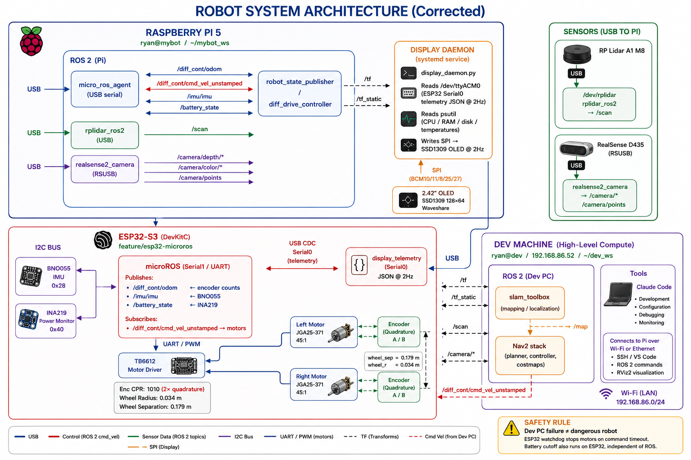

# Autonomous Multi-Sensor Mobile Robot — CLAUDE.md

This file provides AI coding assistants (Claude Code, ChatGPT Codex, etc.) with the context needed to contribute effectively to this project.

Hardware docs live in `docs/hardware/`. The quick-reference GPIO map is in `docs/hardware/README.md`.

---

## Project Overview

A distributed ROS 2 Humble autonomous mobile robot (AMR) — clean, standalone build from scratch. Capable of autonomous mapping, SLAM, navigation, obstacle avoidance, multi-sensor fusion, semantic perception, and environmental monitoring. Architecture mirrors a commercial AMR, not a hobby robot.

> **For AI assistants:** This is a standalone project. Do not reference, import patterns from, or compare against any other robot project. All wiring and pinout data in `docs/hardware/` is correct for this build.

---

## System Architecture



### Layer Responsibilities

| Layer | Hardware | Key Responsibilities |
|---|---|---|
| Embedded controller | ESP32-S3-DevKitC-1 on Lonely Binary expansion board | PID motor control, encoder counting, IMU + battery sensing, safety watchdog, micro-ROS publisher |
| Sensor bridge | Raspberry Pi 5 | micro-ROS agent, LiDAR driver, RealSense driver, EKF, Nav2 (light nodes) |
| High-level compute | Development PC | SLAM Toolbox, Nav2, RViz2, YOLO, rosbag, AI nodes |

---

## Confirmed Hardware

| Component | Model | Interface | Layer |
|---|---|---|---|
| Power | RPI5 PD Power Hat P01 | DC barrel 9–24V → 5V/8A USB PD to Pi | Pi |
| Compute (Pi) | Raspberry Pi 5 | USB PD power, USB-A devices, Ethernet/Wi-Fi | Pi |
| Microcontroller | ESP32-S3-DevKitC-1 on Lonely Binary expansion board | Serial1 UART (GPIO 17/18) → USB adapter → Pi `/dev/ttyUSB0` (micro-ROS) \| Serial0 USB CDC → Pi `/dev/ttyACM0` (display telemetry) | ESP32 |
| Motor driver | Adafruit TB6612FNG breakout | GPIO 10–15 (PWM + direction) | ESP32 |
| Motors + encoders | JGA25-371 DC 12V, 45:1 gear ratio | GPIO 39–42 (quadrature, 1010 CPR) | ESP32 |
| IMU | Adafruit BNO055 breakout | I2C GPIO 8/9, addr 0x28 | ESP32 |
| Battery monitor | Adafruit INA219 breakout | I2C GPIO 8/9, addr 0x40 | ESP32 |
| Env sensor | BME680 breakout | I2C GPIO 8/9, addr 0x76 — **not yet wired** | ESP32 |
| 2D LiDAR | Slamtec RPLidar A1 M8 | USB 2.0 → Pi `/dev/rplidar` | Pi |
| RGB-D camera | Intel RealSense D435 | USB 3.0 → Pi (640×480 @ 15fps, RSUSB) | Pi |
| OLED display | Waveshare 2.42" OLED (SSD1309) | SPI0 GPIO 10/11/8/25/27 → Pi — **not yet wired** | Pi |

---

## Power Architecture

```
Battery (9–24V DC, e.g. 3S LiPo ~12V)
    └── RPI5 PD Power Hat INPUT (DC barrel)
            ├── OUTPUT USB-C  →  Raspberry Pi 5 (5.15V / 5A, USB PD 3.0)
            │       ├── Pi USB-A  →  ESP32-S3 Serial1 UART adapter  (micro-ROS, /dev/ttyUSB0)
            │       ├── Pi USB-A  →  ESP32-S3 Serial0 USB CDC       (display telemetry, /dev/ttyACM0)
            │       ├── Pi USB-A  →  RPLidar A1      (power + data, USB 2.0)
            │       └── Pi USB-A  →  RealSense D435  (power + data, USB 3.0)
            └── VIN screw terminal  →  TB6612FNG VM  (raw battery voltage, motor power)

TB6612 logic VCC  →  ESP32 3V3 pin
Common ground: Battery −, hat GND, Pi GND, ESP32 GND, TB6612 GND — all one rail.
```

---

## ESP32-S3 GPIO Map (confirmed)

| GPIO | Function |
|---|---|
| 8 | I2C SDA — BNO055 (0x28), INA219 (0x40), BME680 (0x76 planned) |
| 9 | I2C SCL |
| 10 | PWMA — Right motor speed (LEDC ch 0, 1 kHz, 8-bit) |
| 11 | AIN1 — Right motor direction A |
| 12 | AIN2 — Right motor direction B |
| 13 | PWMB — Left motor speed (LEDC ch 1, 1 kHz, 8-bit) |
| 14 | BIN1 — Left motor direction A |
| 15 | BIN2 — Left motor direction B |
| 17 | UART1 TX — Serial1 micro-ROS transport to Pi (via USB-UART adapter) |
| 18 | UART1 RX — Serial1 micro-ROS transport from Pi (via USB-UART adapter) |
| 19, 20 | Native USB D−/D+ — Serial0 USB CDC → display telemetry JSON to Pi |
| 39 | Right encoder B (read in ISR) |
| 40 | Left encoder A — `attachInterrupt` CHANGE ⚠️ EMI |
| 41 | Left encoder B (read in ISR) ⚠️ EMI |
| 42 | Right encoder A — `attachInterrupt` CHANGE |

**Motor A = RIGHT, Motor B = LEFT.**
STBY not wired — Adafruit breakout has onboard 10 kΩ pull-up (always enabled).

⚠️ **GPIO 40/41 EMI:** Left encoder picks up TB6612 1 kHz PWM noise. EMA filter (`VEL_ALPHA = 0.2`) mitigates in firmware. Hardware fix: route left encoder wires through a breadboard with 100 nF ceramic caps from GPIO 40 → GND and GPIO 41 → GND before connecting to ESP32.

**Avoid:** GPIO 4,5,6,7 (not broken out), 25,26,27,32,33 (not broken out), 35/36/37 (internal flash), 38 (RGB LED), 43/44 (UART0), 0/45/46 (strapping pins).
GPIO 17/18 = Serial1 (micro-ROS). GPIO 19/20 = Serial0 USB CDC (display telemetry). Do not repurpose these.

---

## Encoder Constants (validated)

| Parameter | Value | Notes |
|---|---|---|
| `ENC_CPR` | 1010 | 2× quadrature, 45:1 gear ratio — validated on floor |
| `wheel_radius` | 0.034 m | Measured (68 mm dia; datasheet says 65 mm) |
| `wheel_separation` | 0.179 m | Measured center-to-center |

Encoder wire colors (JGA25-371): Red/White = motor power, Blue/Black = encoder power, Yellow = Ch A, Green = Ch B.

---

## Serial Transport (ESP32 ↔ Pi) — Dual Port

The ESP32-S3 uses **two independent serial connections** to the Pi, on two separate USB ports:

| Role | ESP32 | Adapter | Pi device | Purpose |
|---|---|---|---|---|
| micro-ROS | Serial1, GPIO 17 TX / 18 RX | USB-UART adapter (CP2102/CH340) | `/dev/ttyUSB0` | ROS topics: odom, IMU, battery, cmd_vel |
| Display telemetry | Serial0, native USB CDC (GPIO 19/20) | USB cable (direct) | `/dev/ttyACM0` | INA219 JSON stream → display daemon |

**Why two ports:** The display daemon is a plain Python systemd service — ROS2-independent, starts at boot, always on. It reads battery voltage directly from Serial0 regardless of whether the micro-ROS agent or ROS2 is running. Battery and system status are visible on the OLED during bringup, crashes, and reflashing.

**Firmware build flags:**
```ini
-DARDUINO_USB_CDC_ON_BOOT=1           ; enables Serial0 USB CDC for display telemetry
-DMICRO_ROS_TRANSPORT_ARDUINO_SERIAL  ; micro-ROS uses hardware Serial1
```

**Serial1 init in firmware:**
```cpp
Serial1.begin(115200, SERIAL_8N1, 18, 17);  // RX=GPIO18, TX=GPIO17
set_microros_serial_transports(Serial1);
```

**Run micro-ROS agent on Pi:**
```bash
source /opt/ros/humble/setup.bash
source ~/microros_ws/install/setup.bash
ros2 run micro_ros_agent micro_ros_agent serial --dev /dev/ttyUSB0 -b 115200
```

Wi-Fi used only for OTA flashing and TelnetStream debug monitoring — **not** for micro-ROS.

---

## ROS 2 Topic Architecture

| Topic | Publisher | Consumer | Rate |
|---|---|---|---|
| `/diff_cont/cmd_vel_unstamped` | Nav2 / twist_mux | ESP32 (via micro-ROS) | 20 Hz |
| `/diff_cont/odom` | ESP32 micro-ROS | robot_localization EKF | 30 Hz |
| `/imu/imu` | ESP32 micro-ROS | robot_localization EKF | 30 Hz |
| `/battery_state` | ESP32 micro-ROS | monitoring nodes | 1 Hz |
| `/odom` | robot_localization | Nav2, SLAM | 20 Hz |
| `/scan` | rplidar_node | slam_toolbox, Nav2 obstacle layer | ~5.5 Hz |
| `/camera/depth/points` | realsense2_camera | Nav2 voxel layer | 15 Hz |
| `/camera/color/image_raw` | realsense2_camera | future: YOLO | 15 Hz |

---

## TF2 Frame Tree

```
map
 └── odom
      └── base_link
           ├── laser
           ├── imu_link
           ├── camera_link
           │     └── camera_depth_frame
           ├── left_wheel
           └── right_wheel
```

`map → odom → base_link` is the foundation. Do not break this chain.

---

## Folder Structure

**Always follow this layout. Do not create files outside these locations without a documented reason.**

```
bot_ws/                               ← workspace root (this repo)
├── src/                              ← all ROS 2 packages (colcon builds from here)
│   ├── esp32_serial_bridge/          ← Python package: micro-ROS agent bridge node
│   │   ├── esp32_serial_bridge/      ← Python module (node source)
│   │   ├── launch/
│   │   ├── config/
│   │   ├── resource/                 ← ament_python marker (do not edit)
│   │   ├── test/
│   │   ├── package.xml
│   │   ├── setup.py
│   │   └── setup.cfg
│   ├── robot_bringup/                ← CMake package: top-level launch files
│   │   ├── launch/
│   │   ├── config/
│   │   ├── package.xml
│   │   └── CMakeLists.txt
│   ├── robot_description/            ← CMake package: URDF + meshes + TF
│   │   ├── urdf/
│   │   ├── meshes/
│   │   ├── launch/
│   │   ├── config/
│   │   ├── package.xml
│   │   └── CMakeLists.txt
│   ├── robot_navigation/             ← CMake package: Nav2 config + maps
│   │   ├── launch/
│   │   ├── config/
│   │   ├── maps/
│   │   ├── package.xml
│   │   └── CMakeLists.txt
│   ├── robot_slam/                   ← CMake package: SLAM Toolbox / RTAB-Map config
│   │   ├── launch/
│   │   ├── config/
│   │   ├── package.xml
│   │   └── CMakeLists.txt
│   └── robot_msgs/                   ← CMake package: custom msg/srv/action definitions
│       ├── msg/
│       ├── srv/
│       ├── action/
│       ├── package.xml
│       └── CMakeLists.txt
├── firmware/
│   └── esp32/                        ← ESP32-S3 firmware (PlatformIO/Arduino, not a ROS pkg)
│       ├── src/                      ← .cpp / .ino source files
│       ├── include/                  ← .h header files
│       └── lib/                      ← local libraries
├── docs/
│   ├── hardware/                     ← per-component hardware reference docs
│   │   ├── README.md                 ← hardware index + GPIO quick-reference
│   │   ├── rpi5_pd_power_hat.md
│   │   ├── dfr0205.md
│   │   ├── esp32_s3.md
│   │   ├── raspberry_pi_5.md
│   │   ├── development_pc.md
│   │   ├── tb6612fng.md
│   │   ├── wheel_encoders.md
│   │   ├── rplidar.md
│   │   ├── realsense_d435.md
│   │   ├── bno055_imu.md
│   │   ├── ina219_battery_monitor.md
│   │   ├── bme680_environmental.md
│   │   └── wiring_audit.md
│   ├── architecture/
│   │   ├── system_overview.md
│   │   └── build_plan.md         ← step-by-step build instructions for Claude Code
│   └── testing/                      ← test protocols, validation checklists, audit reports
├── scripts/                          ← shell utility scripts (not ROS nodes)
├── .gitignore
└── CLAUDE.md                         ← this file

# colcon generates these at build time — never commit them:
# build/   install/   log/
```

### Rules for new files

| What you're adding | Where it goes |
|---|---|
| New ROS node (Python) | New package under `src/`, or inside existing package's Python module folder |
| New launch file | `src/<package>/launch/` |
| New YAML config | `src/<package>/config/` |
| New custom message | `src/robot_msgs/msg/` |
| New custom service | `src/robot_msgs/srv/` |
| URDF / xacro | `src/robot_description/urdf/` |
| Mesh files | `src/robot_description/meshes/` |
| ESP32 firmware source | `firmware/esp32/src/` |
| Hardware reference doc | `docs/hardware/` |
| Architecture / design doc | `docs/architecture/` |
| Test protocol, validation checklist, or audit report | `docs/testing/` |
| Utility shell script | `scripts/` |

---

## docs/testing/ Rules

This folder holds all test and validation documentation. Do not put test scripts here — those go in `src/<package>/test/`. This folder is for human-readable docs only.

| Document type | Naming convention | Notes |
|---|---|---|
| Gate / MVP test protocol | `<feature>_test_protocol_<YYYY-MM-DD>.md` | Operator checklists with pass/fail gates |
| Validation run log | `<feature>_validation_<YYYY-MM-DD>.md` | Recorded results from a specific test session |
| Repo / system audit | `audit_<YYYY-MM-DD>.md` | Static analysis or manual code/hardware audit |
| Definition of Done | `dod_<feature>.md` | Acceptance criteria for a subsystem or milestone |

**Rules:**
- Every file must have a date in the filename (`YYYY-MM-DD`).
- Protocols describe *how* to test. Logs describe *what happened* during a test. Keep them separate.
- Do not commit incomplete or in-progress logs — finish the run, then commit results.
- Gate-style protocols (pass/fail per gate) are preferred over freeform notes.

---

## Timing Requirements

| System | Rate |
|---|---|
| PID / encoder loop | 100 Hz |
| IMU + odom publish (micro-ROS) | 30 Hz |
| LiDAR scan (RPLidar A1) | ~5.5 Hz |
| RealSense depth + color | 15 Hz |
| EKF output (`/odom`) | 20 Hz |
| Nav2 controller | 20 Hz |
| Battery publish | 1 Hz |

---

## ROS 2 Development Standards

These rules apply to every ROS 2 package written in this project. Based on [Henki ROS 2 Best Practices](https://github.com/henki-robotics/henki_ros2_best_practices).

### Nodes
- Each node has a single responsibility. Do not combine unrelated concerns in one node.
- Separate application logic from ROS 2 communication. Put the core logic in a plain class or library; the ROS node only handles pub/sub/parameters. This makes the logic unit-testable without spinning up a ROS environment.

### Launch Files
- Use **XML** launch files (`.launch.xml`), not Python, unless Python is genuinely required for dynamic logic.
- Never pass or hardcode node parameters in launch files. Use config YAML files and load them with `<param from="..."/>`.

### Parameters
- All node parameters live in YAML files under `src/<package>/config/`.
- Never hardcode parameter values in node source code.
- If a parameter must be changeable at runtime, implement a parameter callback (`add_on_set_parameters_callback`).

### Logging
- Use the ROS 2 logger (`RCLCPP_INFO`, `RCLCPP_WARN`, `RCLCPP_ERROR` / `self.get_logger()`) — never `print()` or `std::cout`.
- Log levels: `INFO` = normal operation, `WARN` = unexpected but recoverable, `ERROR` = system no longer operating correctly.
- **Never log inside high-frequency callbacks without throttling.** The IMU, odom, and encoder callbacks run at 30–100 Hz. Use `RCLCPP_INFO_THROTTLE` / `get_logger().throttled` to cap log rate at 1 Hz or less for any message inside these loops.

### Message Interfaces
- Reuse standard interfaces first: `geometry_msgs`, `sensor_msgs`, `nav_msgs`, `std_srvs`.
- Custom message types go in `src/robot_msgs/` — already set up. Do not define custom messages inside other packages.
- Do not use primitive `std_msgs` types (`Float32`, `Bool`, `String`) in production code — create a semantically named custom message instead.

### Actions and Services
- Services only for fast operations (<1 second): state requests, mode switches, parameter gets/sets.
- Actions for anything that takes time, can fail in multiple ways, or needs cancellation (Nav2 goals, SLAM operations).
- Use enum constants for action error codes, not freeform strings, so clients can parse them reliably.

### Executors
- Use `SingleThreadedExecutor` by default. It is deterministic, easier to test, and has lower overhead.
- Only use `MultiThreadedExecutor` when a callback genuinely blocks and concurrent execution is required — not as a default.

### Performance
- Use C++ for any node with a high-frequency control loop or high-bandwidth data (encoders, motor control, point cloud processing).
- Use Python for tooling, high-level orchestration, and the display daemon.
- For the RealSense point cloud pipeline (Phase 6+): use **composable nodes** with intra-process communication to avoid copying large point cloud data over DDS.

### Package Documentation
Every package under `src/` must have a `README.md` covering:
- What the package does (one paragraph)
- How to launch it
- All published and subscribed topics, with message types and rates
- All services and actions
- All parameters with type, description, and default value

### QoS (Quality of Service)
Define QoS profiles in YAML config files — never hardcode them in node source. This lets you tune reliability and history without recompiling.

QoS profiles for this project:

| Topic | Profile | Reason |
|---|---|---|
| `/diff_cont/odom`, `/imu/imu` | `sensor_data` (BEST_EFFORT, VOLATILE) | 30 Hz — a dropped message is immediately replaced |
| `/scan` | `sensor_data` (BEST_EFFORT, VOLATILE) | 5.5 Hz sensor stream |
| `/camera/depth/points`, `/camera/color/image_raw` | `sensor_data` (BEST_EFFORT, VOLATILE) | High-bandwidth, latency-sensitive |
| `/diff_cont/cmd_vel_unstamped` | `system_default` (RELIABLE, VOLATILE) | Safety-critical — must not silently drop velocity commands |
| `/battery_state` | `system_default` (RELIABLE, VOLATILE) | Low rate, must not miss battery cutoff alerts |
| `/map`, `/odom`, `/tf` | `system_default` (RELIABLE, TRANSIENT_LOCAL) | State data — late-joining nodes must receive last known value |

In Python nodes, set QoS via `rclpy.qos.QoSProfile`. In C++ nodes, use `rclcpp::QoS`. Load the profile selection from the node's YAML config so it can be overridden without code changes.

### Node Architecture Pattern (Odom / IMU Pipeline)
The encoder-to-odometry pipeline in this project is directly analogous to the Henki speed monitor example. Apply the same before/after pattern:

**Do not do this** (logic inside the ROS callback):
```python
def odom_callback(self, msg):
    # raw encoder math, unit conversion, filtering all here
    speed_mps = msg.twist.twist.linear.x
    speed_kph = speed_mps * 3.6
    self.publisher_.publish(...)
```

**Do this instead** (logic in a separate class):
```python
# odometry_converter.py — no ROS imports, fully unit-testable
class OdometryConverter:
    def compute_speed(self, linear_x_mps):
        return linear_x_mps * 3.6, linear_x_mps * 2.237

# esp32_bridge_node.py — ROS layer only
class Esp32BridgeNode(Node):
    def __init__(self):
        self._converter = OdometryConverter()  # plain class, no ROS
    def odom_callback(self, msg):
        kph, mph = self._converter.compute_speed(msg.twist.twist.linear.x)
        self.publisher_.publish(...)
```

This pattern applies to: `esp32_serial_bridge` (serial parsing + unit conversion), `robot_localization` config (EKF math lives in the library, not the node), and any future sensor processing nodes.

### Testing
- Unit-test core application logic (the plain class, not the ROS node). Logic separated from ROS needs no ROS environment to test.
- Integration-test ROS communication behavior (topic flow, parameter loading, launch files).
- Target 90%+ coverage on core logic.
- Never use `time.sleep()` or `rclcpp::sleep_for()` in tests to wait for messages. Use synchronization primitives or a timed spin with a proper timeout.

---

## Critical Design Rules

### Safety
- ESP32 safety watchdog must run continuously, independent of ROS, Wi-Fi, and the dev PC.
- If no velocity command is received within the timeout window, ESP32 stops the motors immediately.
- Battery voltage cutoff runs on the ESP32 — never depend on ROS for battery safety.
- **Dev PC failure must never cause a dangerous robot.**

### Electrical
- All subsystems share one common ground: Battery −, ESP32, Pi, TB6612, encoders, sensors.
- Missing common ground causes serial errors, PWM noise, encoder EMI, and motor glitches.
- GPIO 40/41 (left encoder) require 100 nF ceramic caps to GND — TB6612 1 kHz PWM couples into these lines. Use a breadboard with caps in the encoder signal path.

### Motion Control
- Closed-loop PID velocity control only (encoder feedback → wheel velocity target in rad/s).
- Never use open-loop PWM for normal operation.
- Motor A = RIGHT wheel, Motor B = LEFT wheel — do not swap.

### micro-ROS
- Transport is Serial1 UART (GPIO 17 TX / 18 RX) via USB-UART adapter to `/dev/ttyUSB0`. Not Wi-Fi, not native USB.
- Serial0 (native USB CDC, GPIO 19/20) is reserved for display telemetry JSON — do not use it for micro-ROS.
- Never change serial device, encoder pins, motor polarity, or controller YAML all at once during debugging. Change one thing, observe, repeat.
- If `micro_ros_agent` gets stuck after OTA flash or watchdog reset: `sudo systemctl restart robot-launch.service`.

### SLAM / Costmaps
- LiDAR is mounted low — detects chair legs and shoes as walls. Mitigate with RealSense depth validation and layered costmaps.
- Nav2 costmap layers: Static (SLAM map) → Obstacle (LiDAR) → Voxel (RealSense) → Semantic (YOLO, future).

### URDF
- All sensor frames defined in URDF relative to `base_link`. TF must always match physical sensor placement.
- Never rename ROS controller, joint, plugin, or topic identifiers without updating all dependents.

---

## SLAM Stack

| Phase | Tool | Reason |
|---|---|---|
| Current | slam_toolbox | Stable 2D mapping, native Nav2 integration |
| Future | RTAB-Map | RGB-D fusion, visual loop closure, semantic mapping |

Sensor fusion layers:
1. **Motion fusion** — encoders + BNO055 → `/odom` via `robot_localization` EKF
2. **Mapping fusion** — LiDAR geometry + RealSense depth → wall validation
3. **Semantic fusion** (future) — YOLO on dev PC GPU → obstacle classification

EKF config notes: IMU orientation is **disabled** (magnetometer unreliable on metal chassis). Angular velocity and linear acceleration are enabled.

---

## Build Plan

The full step-by-step build plan — with files to create, implementation details, and validation gates — is in:

**[`docs/architecture/build_plan.md`](docs/architecture/build_plan.md)**

### Rules for Claude Code

- **Read `build_plan.md` before starting any implementation work.** It is the authoritative source for what to build next.
- **Follow phases in order.** Do not implement Phase N+1 until Phase N's validation gate passes.
- **Update the status table** in `build_plan.md` when a phase completes.
- **Do not change hardware constants** (GPIO pins, I2C addresses, topic names, frame IDs, encoder CPR, wheel dimensions) without explicit user instruction. These are validated hardware values.
- **One thing at a time.** When debugging, change one variable (param, pin, config) and observe before changing another.
- **Commit at phase boundaries** using the commit prefix convention in `build_plan.md`.

### Development Order (summary)

| Phase | Goal |
|---|---|
| 0 | Hardware & environment (complete) |
| 1 | ESP32 firmware: PID, encoders, IMU, battery, micro-ROS, watchdog |
| 2 | URDF + TF tree validated in RViz2 |
| 3 | Sensor bridge + **LiDAR verified on `/scan`** + RealSense + EKF → smooth `/odom` — LiDAR must pass before Phase 4 |
| 4 | SLAM: build and save a consistent 2D map (requires Phase 3 LiDAR verified) |
| 5 | Nav2: autonomous navigation — **MVP milestone** |
| 6 | BME680 env sensor + RealSense voxel costmap |
| 7 | Semantic perception (YOLO on dev PC GPU) |

---

## Useful Debugging Commands

```bash
# Verify devices on Pi
ls /dev/rplidar
ls /dev/serial/by-id/usb-Espressif*

# micro-ROS agent (Serial1 UART via USB adapter)
ros2 run micro_ros_agent micro_ros_agent serial --dev /dev/ttyUSB0 -b 115200

# Monitor display telemetry stream (Serial0 USB CDC)
cat /dev/ttyACM0

# Topic health
ros2 topic hz /diff_cont/odom
ros2 topic hz /imu/imu
ros2 topic hz /scan
ros2 topic echo /battery_state

# TF debugging
ros2 run tf2_tools view_frames
ros2 run tf2_ros tf2_echo base_link laser

# I2C sensor check (on ESP32 host via Pi)
sudo i2cdetect -y 1   # expect: 0x28 (BNO055), 0x40 (INA219)

# LiDAR stale process fix
sudo fuser -k /dev/rplidar
```

---

## MVP Acceptance Criteria

The robot is considered minimally operational when it can:

- Drive reliably under closed-loop PID velocity control
- Publish stable `/diff_cont/odom` and `/odom` (EKF fused)
- Build a consistent 2D map with `slam_toolbox`
- Avoid collisions during autonomous Nav2 navigation
- Stop safely on ESP32 watchdog timeout (no Pi or PC required)
- Stream battery state at 1 Hz independently of ROS

---

## Environment

| Item | Value |
|---|---|
| OS | Ubuntu 22.04 LTS |
| ROS | ROS 2 Humble Hawksbill |
| Pi | Raspberry Pi 5 |
| ESP32 firmware | PlatformIO + Arduino framework — `firmware/esp32/` |
| micro-ROS agent | Built from source in `~/microros_ws` (not in apt for arm64) |
| Python | 3.10+ for ROS nodes |
| Dev PC GPU | NVIDIA RTX preferred for YOLO / point cloud processing |
